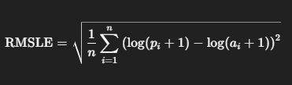

---

## 🚲 Bike Sharing Demand - Kaggle Challenge

---

### 📌 Descripción del reto
Los sistemas de bicicletas compartidas permiten alquilar bicicletas por periodos cortos a través de estaciones automáticas distribuidas por la ciudad. En este desafío, se pide predecir cuántas bicicletas serán alquiladas en un determinado momento, utilizando información sobre el clima, la fecha y otros factores.

El dataset contiene información horaria de dos años, y el entrenamiento se realiza con los primeros 19 días de cada mes, mientras que las predicciones deben hacerse desde el día 20 en adelante.

La métrica de evaluación utilizada es el Root Mean Squared Logarithmic Error (RMSLE).

---

### 📦 Objetivo

Predecir el número total de alquileres (`count`) por hora, utilizando únicamente la información disponible **previa al momento de la predicción**.

---

### 📁 Estructura del Dataset

| Columna      | Descripción |
|--------------|-------------|
| `datetime`   | Fecha y hora del registro |
| `season`     | Temporada del año (1: primavera, 2: verano, 3: otoño, 4: invierno) |
| `holiday`    | Si el día fue festivo |
| `workingday` | Si fue un día laboral (ni fin de semana ni festivo) |
| `weather`    | Condición climática categorizada (de 1 a 4) |
| `temp`       | Temperatura en °C |
| `atemp`      | Sensación térmica en °C |
| `humidity`   | Humedad relativa |
| `windspeed`  | Velocidad del viento |
| `casual`     | Alquileres por usuarios no registrados |
| `registered` | Alquileres por usuarios registrados |
| `count`      | Total de alquileres por hora (objetivo de predicción) |

---

### 🧪 Evaluación

Las predicciones se evalúan con la métrica **RMSLE (Root Mean Squared Logarithmic Error)**, que penaliza más las predicciones por debajo del valor real y es adecuada para distribuciones sesgadas con valores extremos.



Donde:
- \( p_i \): valor predicho
- \( a_i \): valor real
- \( n \): número de muestras

---

### 🔗 Fuente del dataset

El conjunto de datos fue provisto por **Hadi Fanaee Tork** y es parte del repositorio de aprendizaje automático de la UCI. Se utiliza principalmente para fines educativos y de práctica en modelado predictivo.

---

## 🧠 Fase 1 - Exploración y Modelado con Notebook

---

En esta fase vamos a unirnos a la competencia de Kaggle y explorar el Notebook **(EDA)_Bike_Sharing_Demand.ipynb**. 

#### 🔧 Requisitos previos

Puedes ejecutar este proyecto directamente en Google Colab. Para ello:

Descarga el notebook **(EDA)_Bike_Sharing_Demand.ipynb**.

Sube el archivo a tu Google Drive.

Ábrelo desde Colab: haz clic derecho sobre el archivo en Drive → Abrir con → Google Colab.

**Nota:**  
La solución presentada en este notebook se basa en trabajos previos de la comunidad de Kaggle.  
En particular, se han tomado ideas y enfoques de los siguientes notebooks:

- 📘 [**biketest** por ensari](https://www.kaggle.com/code/ensari/biketest)
- 📗 [**Bike Sharing Demand** por jaeraklim](https://www.kaggle.com/code/jaeraklim/bike-sharing-demand)

Estas soluciones sirvieron como guía para realizar la ingeniería de características, entrenar modelos como Random Forest, XGBoost y LightGBM, y estructurar la lógica de predicción para el envío de resultados a la competencia.


📝 **Pasos para ejecutar el notebook**

1. Únete al reto en Kaggle y acepta las reglas para habilitar la descarga de los datos:

   👉 https://www.kaggle.com/competitions/bike-sharing-demand/data

2. Asegúrate de tener los siguientes archivos descargados desde Kaggle:

   - `train.csv`
   - `test.csv`

3. Existen dos formas de acceder a estos archivos desde el notebook en Google Colab:

   - **Opción A**: Subir los archivos directamente al entorno de Colab:
     - Haz clic en el ícono de carpeta (a la izquierda en Colab).
     - Luego haz clic en el ícono de subir archivo (flecha hacia arriba).
     - Carga `train.csv` y `test.csv`.

   - **Opción B**: Cargar archivos desde tu Google Drive:
     - Conecta Colab a tu Google Drive al ejecutar este código en una celda:
       ```python
       from google.colab import drive
       drive.mount('/content/drive')
       ```
     - Coloca los archivos en una carpeta de tu Drive (por ejemplo, `/content/drive/MyDrive/bike-sharing/`)
     - Luego carga los datos desde esa ruta en tu notebook.

Ejecuta el notebook (EDA)_Bike_Sharing_Demand.ipynb siguiendo las celdas paso a paso.

#### ⚙️ ¿Qué hace el notebook?

Carga de datos (train.csv, test.csv)

Limpieza y verificación de valores faltantes

Análisis exploratorio con visualizaciones de tendencias

Ingeniería de características:

Extracción de hour, day, month, year desde la columna datetime

Conversión de variables si es necesario

Entrenamiento de modelos:

🎲 Random Forest 

💡 LightGBM 

⚡ XGBoost 

Evaluación con la métrica **RMSLE**

Generación de archivos de envío (submission.csv) listos para subir a Kaggle

#### 📂 Archivos generados
**submission_rf.csv** → predicciones usando Random Forest

**submission_lgb.csv** → predicciones usando LightGBM

**submission_xgb.csv** → predicciones usando XGBoost

#### 🚀 Cómo subir a Kaggle
Ve al apartado "Submit Predictions" del reto:

👉 [https://www.kaggle.com/competitions/bike-sharing-demand/submit](https://www.kaggle.com/competitions/bike-sharing-demand/overview)

Carga alguno de los archivos .csv generados (por ejemplo, submission_lgb.csv).

Asigna un nombre a tu envío.

Haz clic en Make Submission.

Kaggle calculará la puntuación basada en la métrica RMSLE.

---

## ⚙️ Fase 2 – Despliegue en contenedor Docker

---

En esta fase vamos a empaquetar todo el flujo de **entrenamiento** y **predicción** en un contenedor Docker, de manera que solo necesites un par de comandos para ejecutar tu modelo en cualquier entorno.

En la carpeta 📁 **`fase-2/`** encontrarás **tres archivos** fundamentales:

| Archivo         | Descripción                                                                                      |
|-----------------|--------------------------------------------------------------------------------------------------|
| `train.py`      | Script que:                                                                                      |
|                 | 1. Carga `train.csv` desde `/data/train.csv`                                                     |
|                 | 2. Convierte `datetime` y extrae `hour`, `day`, `month`, `year`                                  |
|                 | 3. Elimina outliers (`count`) y escala las features con `StandardScaler`                         |
|                 | 4. Entrena un `LGBMRegressor` y guarda el modelo en `/data/model.pkl`                            |
|                 | 5. Guarda el objeto `StandardScaler` en `/data/scaler.pkl`                                       |
| `predict.py`    | Script que:                                                                                      |
|                 | 1. Carga `test.csv` desde `/data/test.csv`                                                       |
|                 | 2. Convierte `datetime` y extrae las mismas variables temporales                                 |
|                 | 3. Aplica el `StandardScaler` guardado (`scaler.pkl`) a las features                             |
|                 | 4. Carga el modelo entrenado (`model.pkl`) y genera predicciones no negativas                    |
|                 | 5. Crea `submission.csv` en `/data/submission.csv` con columnas `datetime,count`                 |
| `Dockerfile`    | Define la imagen Docker:                                                                         |
|                 | - Base: `python:3.8-slim`                                                                        |
|                 | - Instala `libgomp1` (requisito de LightGBM) y dependencias Python (`pandas`, `lightgbm`, etc.)  |
|                 | - Copia `train.py` y `predict.py`                                                                |
|                 | - Monta `/data` como volumen para montar `train.csv`, `test.csv`, y crear `model.pkl`, etc.      |


### 🖥️ 0. Prerrequisitos

1. **Instalar Docker Desktop**  
   - Windows Pro/Enterprise/Education: instalación nativa con Hyper-V.  
   - Windows Home: habilita WSL 2 (Windows Subsystem for Linux v2) y marca “Use the WSL 2 based engine” en Settings → General.  
   - Linux (Ubuntu, etc.): instala Docker Engine siguiendo la [documentación oficial](https://docs.docker.com/engine/install/).

2. **Arrancar Docker**  
   - En Windows: abre **Docker Desktop** y espera a que el icono de la ballena en la bandeja se ponga verde (“Docker is running”).  
   - En Linux: asegúrate de que el servicio `docker` esté activo (`systemctl status docker`).

3. **Estructura de carpetas**  
   En la raíz de tu proyecto `Bike-Sharing-Demand/`, crea una carpeta llamada `data/` y coloca dentro:
   
   - **train.csv**: el CSV original de Kaggle con las columnas `datetime,…,count`.  
   - **test.csv**: el CSV de Kaggle que debes predecir (`datetime,…` sin `count`).  
   - **data/** también recibirá `model.pkl`, `scaler.pkl` y `submission.csv` tras la ejecución.


### 🐳 1. Construcción de la imagen Docker

Abre una terminal y ejecuta este comando en la carpeta `fase-2/` (donde está tu Dockerfile):

```bash
docker build -t bikeshare .
```

- docker build → construye una nueva imagen Docker.

- -t bikeshare → etiqueta la imagen como bikeshare (nombre fácil de recordar).

- . → indica que el contexto (Dockerfile y scripts) está en el directorio actual.


### 🧠 2. Entrenamiento del modelo

Una vez construida la imagen, monta tu carpeta data/ como volumen en /data dentro del contenedor para entrenar, así:

En Windows PowerShell
```bash
docker run --rm `
  -v "${PWD}\..\data:/data" `             # Monta Bike-Sharing-Demand/data ⇒ /data
  bikeshare `                             # Usa la imagen bikeshare
  train.py --input_file /data/train.csv ` # Script de entrenamiento
           --model_file /data/model.pkl ` # Guarda modelo entrenado
           --scaler_file /data/scaler.pkl `# Guarda el scaler
           --overwrite_model              # Sobrescribe si ya existe
```
En Linux /bash
```bash
docker run --rm \
  -v "$PWD/../data:/data" \
  bikeshare \
  train.py --input_file  /data/train.csv \
           --model_file  /data/model.pkl \
           --scaler_file /data/scaler.pkl \
           --overwrite_model
```
Posible resultado:
   ```bash
   2025-05-25 21:10:58.607 | INFO     | __main__:load_and_preprocess:40 - Outliers eliminados: 147 filas
   2025-05-25 21:10:58.615 | INFO     | __main__:train_and_save:62 - Entrenando modelo LGBM
   2025-05-25 21:11:00.609 | SUCCESS  | __main__:train_and_save:68 - Modelo guardado en /data/model.pkl
   2025-05-25 21:11:00.610 | SUCCESS  | __main__:train_and_save:69 - Scaler guardado en /data/scaler.pkl
   [LightGBM] [Info] Auto-choosing col-wise multi-threading, the overhead of testing was 0.000524 seconds.
   You can set `force_col_wise=true` to remove the overhead.
   [LightGBM] [Info] Total Bins 297
   [LightGBM] [Info] Number of data points in the train set: 10739, number of used features: 12
   [LightGBM] [Info] Start training from score 183.003818
   ```

Explicación de cada parte:

  - docker run --rm → lanza un contenedor y lo elimina al terminar.
   
  - -v host_path:container_path → monta tu carpeta local data/ en /data dentro del contenedor.
   
  - bikeshare → la imagen que construimos.
   
  - train.py --input_file … → script que:
   
  - Carga train.csv.
   
  - Extrae hour, day, month, year.
   
  - Elimina outliers y escala con StandardScaler.
   
  - Entrena LGBMRegressor.
   
  - Guarda el modelo y el scaler en /data/model.pkl y /data/scaler.pkl.
   
  - Al terminar verás en tu carpeta data/:
   
  - model.pkl → el modelo LightGBM entrenado.
   
  - scaler.pkl → el objeto StandardScaler para procesar test.


### 🔮 3. Generar predicciones

Con el modelo y el scaler ya en data/, monta de nuevo y corre:

En Windows PowerShell
```bash
docker run --rm `
  -v "${PWD}\..\data:/data" `
  bikeshare `
  predict.py --input_file       /data/test.csv `   # Test sin etiquetas
             --model_file       /data/model.pkl `  # Modelo entrenado
             --scaler_file      /data/scaler.pkl ` # Mismo scaler usado en train
             --predictions_file /data/submission.csv  # Salida de predicciones
```

En Linux /bash
```bash
docker run --rm \
  -v "$PWD/../data:/data" \
  bikeshare \
  predict.py --input_file       /data/test.csv \
             --model_file       /data/model.pkl \
             --scaler_file      /data/scaler.pkl \
             --predictions_file /data/submission.csv
```
Posible resultado:
   ```bash
   2025-05-25 21:12:33.207 | SUCCESS  | __main__:predict_and_save:54 - Predicciones guardadas en: /data/submission.csv
   ```

Qué hace predict.py

  - Valida que test.csv, model.pkl y scaler.pkl existan.
   
  - Carga test.csv, convierte datetime, extrae variables temporales.
   
  - Aplica el StandardScaler al set de features.
   
  - Carga el modelo y genera predicciones no negativas.
   
  - Crea submission.csv con columnas:
      ```bash
            datetime,count
      2011-01-20 00:00:00,12
      2011-01-20 01:00:00, 8
      …
      ```


### ✅ 4. Verificación

Listado de archivos antes y después de cada paso:

   En Windows PowerShell
   ```bash
   docker run --rm `
     -v "${PWD}\..\data:/data" `
     --entrypoint bash `
     bikeshare `
     -c "ls -l /data"
   ```
   
   En Linux /bash
   ```bash
   docker run --rm -v "$PWD/../data:/data" --entrypoint bash bikeshare \
     -c "ls -l /data"
   ```

Posible resultado: 
   ```bash
   total 2468
   -rw-r--r-- 1 root root 1387488 May 25 19:00 model.pkl
   -rw-r--r-- 1 root root    1351 May 25 19:00 scaler.pkl
   -rw-r--r-- 1 root root  152818 May 25 19:00 submission.csv
   -rwxrwxrwx 1 root root  323856 May 25 03:52 test.csv
   -rwxrwxrwx 1 root root  648353 May 25 03:52 train.csv
   ```

Comprobación de formato de las primeras líneas:

   En Windows PowerShell
   ```bash
   docker run --rm `
     -v "${PWD}\..\data:/data" `
     --entrypoint bash `
     bikeshare `
     -c "head -n 5 /data/submission.csv"
   ```
   
   En Linux /bash
   ```bash
   docker run --rm -v "$PWD/../data:/data" --entrypoint bash bikeshare \
     -c "head -n 5 /data/submission.csv"
   ```

Posible resultado: 
   ```bash
   datetime,count
   2011-01-20 00:00:00,17
   2011-01-20 01:00:00,1
   2011-01-20 02:00:00,0
   2011-01-20 03:00:00,1
   ```

Explicación paso a paso:

  - docker run --rm
   Arranca un contenedor y lo elimina al terminar.
   
  - `-v "${PWD}\..\data:/data"`
   Monta tu carpeta local Bike-Sharing-Demand/data (una carpeta arriba de fase-2) en /data del contenedor.
   
  - `--entrypoint bash`
   Anula el ENTRYPOINT por defecto (python) y usa bash.
   
  - bikeshare
   Nombre de la imagen.
   
  - `-c "ls -l /data"`
   Le dice a bash que ejecute el comando ls -l /data.

Con esto tendrás un contendor reproducible que:

  - Entrena tu modelo con un solo comando.
   
  - Predice y genera el CSV listo para subir a Kaggle.
   
  - Mantiene tu carpeta data/ como único punto de montaje, evitando confusiones con rutas.

---

## 🚀 Fase 3 - API REST

---

Esta fase expone un modelo predictivo como servicio REST, con dos endpoints:

   - POST /predict: devuelve predicciones a partir de datos JSON.

   - POST /train: reentrena el modelo con el CSV /data/train.csv y actualiza los artefactos.

     

### 🔧 Requisitos previos

- Docker instalado en el sistema.

- Los archivos model.pkl, scaler.pkl y train.csv deben estar en el directorio data ubicado una carpeta arriba de fase-3.

- Antes de construir la imagen de la fase 3 (bikeshare-api), es necesario que hayas construido la imagen de la fase 2, llamada bikeshare, ya que esta se usa como base en el Dockerfile.

### 🧱 Construir la imagen base de la Fase 2

Desde el directorio fase-2/

En Windows (PowerShell)
   ```bash
   cd .\fase-2
   ```

En Linux / macOS (Bash)
   ```bash
   cd fase-2
   ```
Cambia el directorio actual a la carpeta fase-2.

ejecuta:
   ```bash
   docker build -t bikeshare .
   ```

   docker build: inicia la construcción de una imagen.

   -t bikeshare: etiqueta la imagen como bikeshare.

   .: indica que use el Dockerfile del directorio actual.

   
### 💪 Construcción del contenedor Docker

Desde el directorio fase-3/

   En Windows (PowerShell)
   ```bash
   cd .\fase-3
   ```

   Cambia el directorio actual a la carpeta fase-3.

   En Windows (PowerShell)
   ```bash
   docker build -t bikeshare-api .
   ```
   docker build: crea una imagen Docker.

   -t bikeshare-api: le da el nombre "bikeshare-api" a la imagen.

   .: usa el Dockerfile en el directorio actual.

   En Linux / macOS (Bash)
   ```bash
   cd fase-3
   ```

   Cambia el directorio actual a la carpeta fase-3.
   
   En Linux / macOS (Bash)
   ```bash
   docker build -t bikeshare-api .
   ```

   docker build: construye la imagen Docker.

   -t bikeshare-api: nombra la imagen.

   .: ruta al Dockerfile (directorio actual).


### 📊 Ejecución del contenedor

   En Windows (PowerShell)
   ```bash
   docker run -d --rm `
   -v "${PWD}\..\data:/data" `
   -p 5000:5000 `
   --name bikeshare-api `
   bikeshare-api
   ```

   docker run: ejecuta un contenedor.

   -d: lo ejecuta en segundo plano (detached).

   --rm: elimina el contenedor al detenerse.

   -v "${PWD}\..\data:/data": monta el directorio ../data como volumen en /data dentro del contenedor.

   -p 5000:5000: expone el puerto 5000 del contenedor en localhost:5000.

   --name bikeshare-api: nombre del contenedor.

   bikeshare-api: imagen que se quiere correr.

   En Linux / macOS (Bash)
   ```bash
   docker run -d --rm \
   -v "$(pwd)/../data:/data" \
   -p 5000:5000 \
   --name bikeshare-api \
   bikeshare-api
   ```

   $(pwd)/../data:/data: monta el volumen correctamente en Linux/macOS.


### 📆 Probar el API con client.py

Una vez que el contenedor esté corriendo, ejecuta:

   ```bash
   python client.py
   ```

Ejecuta el script client.py, el cual hace una petición POST a /predict y luego a /train.

Este script sirve como prueba automatizada de que el API REST está funcionando.

Posible resultado:
   ```bash
   Predict response: {'count': [5, 2]}
   Train response: {'message': 'Modelo y scaler actualizados correctamente.'}
   ```

### 🚮 Detener el contenedor

   ```bash
   docker stop bikeshare-api
   ```

   Detiene el contenedor llamado bikeshare-api (si no usaste --rm).
   

### 📌 Endpoints disponibles

  - POST /predict: Recibe JSON con datos. Devuelve la predicción de bicicletas.
   
  - POST /train: Reentrena el modelo con train.csv y actualiza los artefactos.


